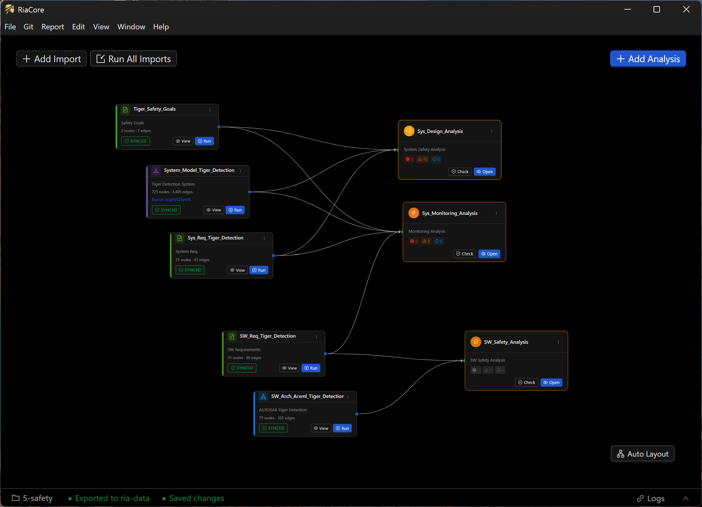
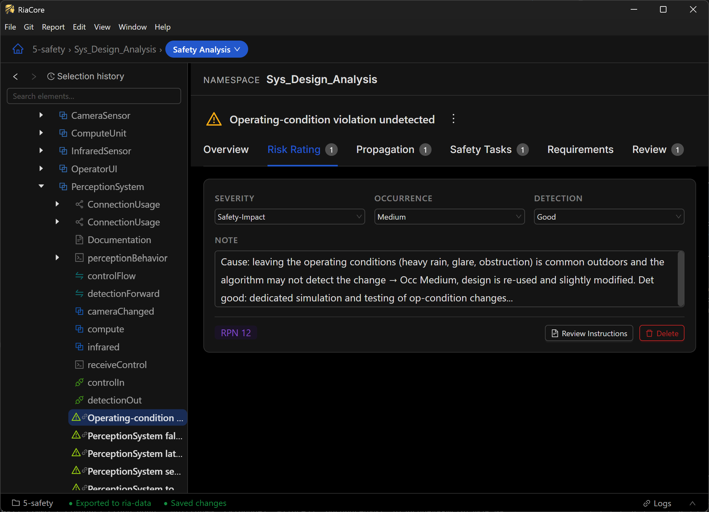

# RiaCore: Modernize Your Safety Engineering Workflow

## [⬇ Download RiaCore](https://github.com/cntSafety/RiaCore/releases)

**Ready-to-run apps for Windows, macOS, and Linux — no build required.**
Open the releases page above and download the package for your platform.
Then follow [Getting Started with Sample Data](#getting-started-with-sample-data).

---

Struggling to bridge the gap between complex system design and rigorous safety standards? RiaCore is an open-source toolkit designed to streamline your safety analysis process, making safety engineering more accessible, collaborative, and structured.

Built with the systems engineer in mind, RiaCore transforms fragmented documentation into a cohesive, analysis-ready framework. Whether you are managing safety goals, defining system requirements, or architecting complex software, RiaCore provides the environment you need to keep your development lifecycle compliant and efficient.

Why choose RiaCore?

- Continuous Safety Integration: Say goodbye to the "wait until the end" approach to safety. RiaCore is highly efficient at continuously updating imported artifacts, allowing you to perform ongoing safety analyses and effortlessly track project progress alongside the engineering lifecycle.

- Integrated Analysis: Move seamlessly from safety goals to software architecture within a unified platform.

- Industry-Ready: Designed to handle standard workflows, including support for formats like ARXML, making it a natural fit for automotive and embedded systems projects.

- Open-Source Flexibility: Leverage a transparent, community-driven tool that puts you in control of your safety engineering pipeline.

Stop wrestling with disconnected spreadsheets and manual tracking. Empower your team with a tool built for the modern safety lifecycle—check out RiaCore.

## Installation

You do not need to build anything to try RiaCore. Prebuilt applications are published in the
[Releases section](https://github.com/cntSafety/RiaCore/releases) of the main repository:

- **Windows** — installer, plus a portable version that runs without installing
- **macOS** — `.dmg`
- **Linux** — `.AppImage`

Grab the package for your platform, start the app, and continue with
[Getting Started with Sample Data](#getting-started-with-sample-data).

If you would like to build RiaCore from source, see [Building from source](#building-from-source) below.

## Screenshots






## Getting Started with Sample Data

The fastest way to get something on screen is the reference project:
[github.com/cntSafety/ref-project](https://github.com/cntSafety/ref-project).

It ships a ready-to-use workspace — importer configs, sample source data (ARXML, SysML, and more), and
persisted `ria-data` — so you can open it directly in RiaCore instead of assembling a workspace and
import configuration by hand.

```bash
git clone https://github.com/cntSafety/ref-project.git
```

Then point RiaCore at the cloned directory as its working directory and load the data from there.

## ⚠️ Qualification notice

**No tool qualification is provided with RiaCore.** Before using it in any project, the qualification
has to be performed according to that project's specific requirements and the applicable safety
standards — for example ISO 26262, IEC 61508, or others relevant to your domain. Deciding on the
required qualification measures, performing them, and documenting the evidence remains the
responsibility of the using project.

## Where data lives

For a given working directory:

- `db/` — the embedded KuzuDB graph database, created automatically on first use
- `ria-config/` — importer configuration
- `ria-data/` — git-friendly JSON export of the graph, written when you store the database
- `logs/` — log output

> **⚠️ Keep the database and logs out of git.** `ria-data/` is the versioned artifact — the full graph
> state lives in those JSON files and can be restored into a fresh database at any time. The `db/`
> directory is a regenerable binary cache, and logs are runtime noise; committing either bloats the
> repository and produces meaningless diffs. Add this to the `.gitignore` of your workspace repository:
>
> ```gitignore
> # Logs
> *.log
> logs/
>
> # Database files
> db
> db.wal
> *.db
> *.db.wal
> ```

---

## Building from source

Only needed if you want to develop RiaCore or build your own packages. For normal use, take a
prebuilt application from the [Releases section](https://github.com/cntSafety/RiaCore/releases) instead.

### Prerequisites

- Node.js ≥ 20
- pnpm ≥ 9

### Setup

```bash
cd RiaCoreDev
pnpm install
pnpm build
```

> **⚠️ Git binary for packaging:** The `pnpm install` step downloads a bundled git binary via the `dugite` package (used by `@riacore/git-service`). If the download fails (e.g. due to a corporate proxy or TLS certificate issue with error `UNABLE_TO_GET_ISSUER_CERT_LOCALLY`), the app will not work — both in packaged builds and during local development. To fix this, either set `NODE_EXTRA_CA_CERTS` to your corporate CA certificate before running `pnpm install`, or manually download the dugite-native release from [GitHub](https://github.com/desktop/dugite-native/releases) and extract it into `node_modules/.pnpm/dugite@2.7.1/node_modules/dugite/git/`.

### Run in development (Electron)

From the repo root, a single command starts both the Vite dev server and Electron:

```bash
cd RiaCoreDev
pnpm dev
```

This works on Windows, macOS, and Linux. It starts the renderer dev server, waits until it's ready on `http://localhost:5173`, then launches Electron automatically. Closing either process shuts both down.

If you see `ERR_CONNECTION_REFUSED`, the dev server hasn't finished starting yet — it will retry automatically.

### Desktop Packaging

Native desktop packages are built on each target OS separately. Do not try to package macOS or Linux artifacts on Windows.

Current release target matrix:
- Windows x64
- macOS arm64
- Linux x64

The packaged desktop app bundles a platform-specific Node sidecar because the Kuzu-backed worker must run under standard Node.js rather than Electron's ABI-modified runtime.

Build from the repo root:

```bash
pnpm package:desktop:win
pnpm package:desktop:mac
pnpm package:desktop:linux
```

Generated paths:
- Staging directory used during packaging: `apps/desktop-host/.release/`
- Final packaging output: `apps/desktop-host/dist-electron/`
- Windows unpacked app for smoke testing: `apps/desktop-host/dist-electron/win-unpacked/`

Distribution artifacts are written to `apps/desktop-host/dist-electron/` by `electron-builder`, for example:
- Windows: installer, portable zip, and unpacked app directory
- macOS: `.dmg`
- Linux: `.AppImage`

`asar` is currently disabled for packaged builds because the external Node worker cannot reliably load its runtime modules from `app.asar`.
